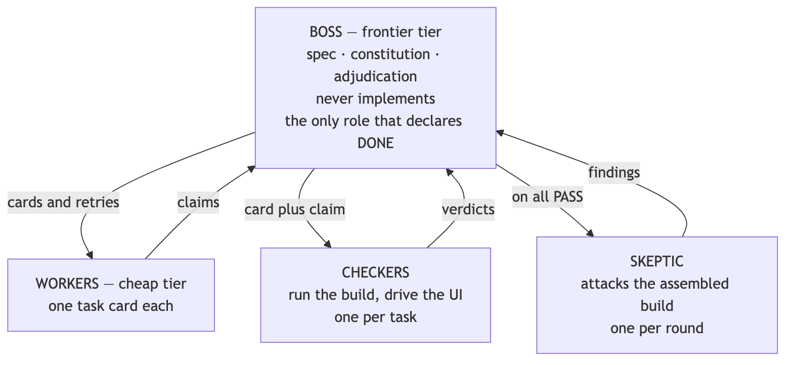
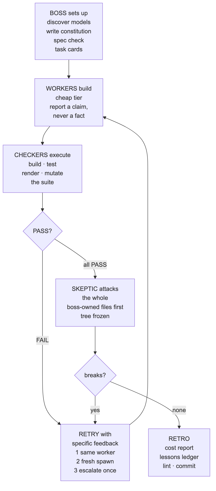
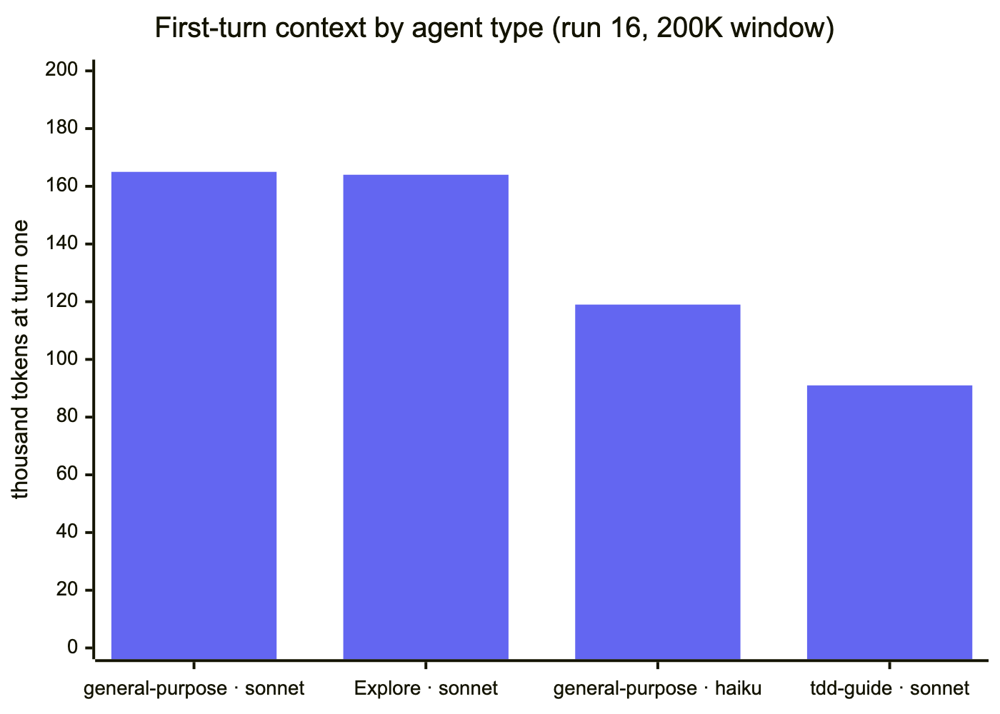
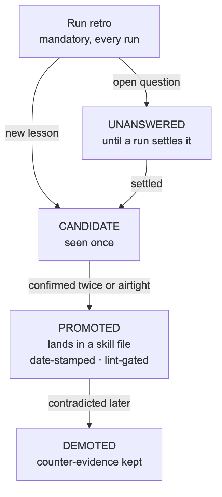

# Foreman

**A boss / worker / checker pattern for AI coding agents.** One expensive model writes the spec and inspects the work but never touches the code. Cheap models do all the building. Every task is verified by an independent agent that *runs* the thing instead of trusting the builder's report. An adversarial skeptic attacks the finished build before anyone calls it done.

[](LICENSE)
[](skill/references/lessons-evidence.md)
[](skill/references/lessons.md)
[](#requirements)
[](https://neonpeach.co)

The result is a run that costs a fraction of an all-frontier build and catches defects that self-review never finds. Every report routes to the boss. Nothing is declared done by the agent that did the work.

<picture>
  <source media="(prefers-color-scheme: dark)" srcset="diagrams/orgchart-dark.png">
  
</picture>

Every arrow ends at the boss. Workers never message each other, checkers never message workers, and the skeptic reports to the boss alone. It cannot dispatch its own fixes and it cannot end the run.

**Contents:** [Why](#why-this-exists) · [How a run works](#how-a-run-works) · [The context killer](#the-one-thing-that-kills-workers-context) · [Field record](#field-record) · [Quick start](#quick-start) · [Install](#install) · [Using it](#using-it) · [Layout](#repository-layout) · [Self-maintenance](#the-skill-maintains-itself) · [Design notes](#design-notes) · [Contributing](#contributing) · [Maintainer](#maintainer)

## Why this exists

Two problems collide when you give a coding agent a real job.

**Cost.** Frontier models are 5 to 10 times the price of small ones. Most of a build is not frontier work: writing markup, wiring a form, adjusting config. Paying top rate for boilerplate is an org design mistake, not a model limitation.

**Trust.** An agent that reports "done, tests passing" is making a claim, not stating a fact. It may have hidden text to satisfy a content check, hardcoded a value to satisfy an assertion, or written unit tests that pass while the shipped feature is broken. Reading the diff and nodding does not catch this. Running the thing does.

Foreman answers both with structure rather than with a better model: expensive judgment at the top, cheap labor in the middle, and independent execution-based verification that nobody, including the boss, is exempt from.

## How a run works

<p align="center">
<picture>
  <source media="(prefers-color-scheme: dark)" srcset="diagrams/runloop-dark.png">
  
</picture>
</p>

**1. Discover the models, do not hardcode them.** At run start Foreman inspects what is actually dispatchable in the session, consults a cached intel table of prices and capabilities, and refreshes that table by research when it is stale. Models map to three bands, FRONTIER, STANDARD and ECONOMY, and all routing logic speaks in bands. A new model release updates one table, not the skill.

**2. The boss writes a constitution first.** Before any work is dispatched, one page defines what "done right" means for this build: stack conventions, quality floor, protected content, forbidden shortcuts, and the exact command that verifies each task type. Every worker and every checker gets it. Checkers grade against the constitution, not against taste.

**3. Task cards, never bare instructions.** Each worker gets exactly one card: objective, the relevant input lines pasted in, a testable done-condition, the verification command quoted verbatim, the required output schema, and the constitution. Ambiguity is the boss's fault, and the boss's spec is itself checked before dispatch.

**4. Checkers execute.** A checker runs the build and reads exit codes, fetches the page and renders it, character-compares protected text, drives the UI in a real browser, and breaks the implementation on purpose to see whether the tests notice. It receives the worker's claim but never the worker's reasoning, because shared reasoning correlates errors. A checker that only read the diff and agreed has failed its job.

**5. Failure is specific, and rank does not protect you.** A FAIL comes back with the command run, what was expected, and what was observed. The same worker retries once with that feedback. A second retry is a fresh spawn with a rewritten card. Workers can dispute a verdict and the boss arbitrates with both sides in hand. When the checker was wrong, the constitution's rubric gets amended so the whole fleet learns. The boss's own output goes through a checker too.

**6. A skeptic attacks the assembled build.** After every task passes, one adversarial agent assumes the build is broken and tries to prove it: integration seams no single task owned, gaming patterns, constitution clauses nobody's checker covered, and the quality of the checks themselves. Its first target is the files the boss owns, because no lane's checker ever looks there. It is scored on real breaks found, not on agreement.

## The one thing that kills workers: context

Across twenty field runs, not one worker death was a model that could not do the task. Every death was context. The biggest single weight is one you never see in the card: the agent type's tool catalogue plus every instruction file the harness injects before the first token of your prompt.

<p align="center">
<picture>
  <source media="(prefers-color-scheme: dark)" srcset="diagrams/context-dark.png">
  
</picture>
</p>

Measured from the subagent transcripts in one run: an all-tools agent type started at 165K of a 200K window before reading a single file, and three of four such workers died of compaction thrash on cards that passed every other rule. The same brief on a five-tool type started at 91K and delivered. That is 74K tokens bought by one parameter.

So the skill measures the baseline before any spawn, forbids all-tools agent types for workers, and treats five known causes as a pre-dispatch checklist:

| Cause | Rule |
|---|---|
| Reading lists that point at large files | The boss pastes the relevant 20 to 50 lines into the card. Reading list is at most two files plus the constitution. |
| Unredirected command output | The first line of every card: every command redirects to a file and tails it. An install or a full test run must never echo into context. |
| Two capabilities in one card | The boss ships the working test harness. The worker's card is "make these tests pass". |
| Retry transcripts piling up | Retry two is a fresh spawn with a rewritten card, not the same transcript plus more feedback. |
| The subject itself is over budget | Measure the file the worker will edit and the suite it will run, not just the card. A 700-line screen file kills a compliant worker. Extract a small module or make it a boss lane. |

Escalating the band for a context death is the common wrong response. A bigger model on the same card dies the same way and costs more. The full protocol, ceilings and death-diagnosis table live in [`skill/references/context-budget.md`](skill/references/context-budget.md).

## Field record

### What it caught on its first live run

A three-task static site build (markup, stylesheet, form validation) with a protected quote that had to ship verbatim:

| Rung | What was caught |
|---|---|
| **The boss** | The spec checker found the task cards never required the ids and classes the other tasks depended on. Each task could pass alone while the assembled site broke. Caught before any worker spawned. |
| **A worker** | The form JS reported "done, 7/7 tests passing" and its unit tests genuinely passed. The browser-driving checker found three integration defects: a phantom success box visible on page load, error boxes that never visually cleared (a CSS `display:flex` rule silently overriding the `hidden` attribute), and native `required` validation blocking the submit handler entirely. |
| **The checkers** | All three tasks passed verification. Then the skeptic broke it anyway: clicking submit a second time after success wiped the confirmation and showed three false errors, deterministic at every delay tested. It also proved the worker's test file was a mirage: seven passing tests, zero DOM coverage of the shipped behavior. |

Nobody had to read a diff to find any of it.

### Twenty runs later

The pattern has since run on a multi-tenant Postgres and Cloud Run service and on a data visualization SaaS. A few things that only show up at that scale:

- **The skeptic finds the boss's gap, every run.** In four consecutive runs, every worker lane passed its checker and the skeptic then found a CRITICAL or HIGH defect in a file the boss had taken over. That is now a standing rule: the skeptic's brief names boss-owned files as target one.
- **Zero deaths is achievable.** Once the baseline rule landed, three runs in a row spawned seven agents each with no context deaths, on cards of 44 to 60 lines.
- **Mutation testing earns its keep.** Checkers routinely kill 11 of 12 or 11 of 14 deliberate mutants. The survivors were real coverage gaps every time, fixed in the retry with their own mutation proofs.
- **The boss is the least-checked agent.** It authored a comparable share of defects to the workers: a wildcard `git add` that once committed 240 MB of provider binaries, corrections sent to workers without ever being executed, leftover containers that starved a worker for a segment. That earned its own reference file.

## Quick start

Three commands and one sentence.

```bash
git clone https://github.com/rwshiraishi/foreman ~/dev/foreman
mkdir -p ~/.claude/skills && ln -s ~/dev/foreman/skill ~/.claude/skills/foreman
python3 ~/.claude/skills/foreman/tools/lint.py
```

Then, inside Claude Code, in a repo with a job that splits into three or more verifiable tasks:

> Run the foreman on this: add CSV export to the reports page, behind the pro plan. Keep it cheap.

The boss writes the spec and constitution, dispatches cards to cheap workers, runs checkers against each, sends a skeptic at the assembled build, and ends with a cost table and a retro.

## Install

### Requirements

- An agent harness that can run more than one agent and can execute commands. Claude Code is the primary target and the only one with per-agent model selection.
- Python 3 for the self-lint script. Nothing else. No build step, no dependencies.
- Node 18 or newer only if you want to regenerate the README diagrams.

### Claude Code

Foreman is a skill: one markdown file, nine reference documents, and one lint script. Claude Code discovers skills in `~/.claude/skills/<name>/SKILL.md` (global) or `.claude/skills/<name>/SKILL.md` (per project).

**Option A, symlink (recommended).** Updates arrive with `git pull`.

```bash
git clone https://github.com/rwshiraishi/foreman ~/dev/foreman
mkdir -p ~/.claude/skills
ln -s ~/dev/foreman/skill ~/.claude/skills/foreman
```

**Option B, copy.** Frozen at the version you copied.

```bash
git clone https://github.com/rwshiraishi/foreman /tmp/foreman
mkdir -p ~/.claude/skills/foreman
cp -r /tmp/foreman/skill/. ~/.claude/skills/foreman/
```

**Project-scoped instead of global.** Use `.claude/skills/foreman/` inside the repo with either option. A project copy wins over a global one.

**Optional slash command.** `/model-route <task>` is a front door that either runs the full pattern or, for jobs below the threshold, prints a one-line band recommendation and spawns nothing.

```bash
mkdir -p ~/.claude/commands
cp ~/dev/foreman/commands/model-route.md ~/.claude/commands/
```

**Verify the install.**

```bash
ls ~/.claude/skills/foreman/SKILL.md            # the skill file is where Claude Code looks
python3 ~/.claude/skills/foreman/tools/lint.py   # prints "OK — caps(9) ids(60) ..." and exits 0
```

Then start a Claude Code session and ask "which skills do you have for multi-agent builds?" Foreman should be listed.

**Update.**

```bash
cd ~/dev/foreman && git pull          # symlink install: done
# copy install: repeat the cp line above
```

**Uninstall.**

```bash
rm -rf ~/.claude/skills/foreman ~/.claude/commands/model-route.md
```

### OpenAI Codex CLI

Codex reads `AGENTS.md` from the project root and supports custom prompts in `~/.codex/prompts/`.

```bash
git clone https://github.com/rwshiraishi/foreman /tmp/foreman
mkdir -p ~/.codex/prompts
cp /tmp/foreman/adapters/codex-foreman.md ~/.codex/prompts/foreman.md
```

Then `/foreman <task description>` in a Codex session. For a project-wide default, append the contents of `skill/SKILL.md` to the repo's `AGENTS.md` under a `## Foreman orchestration` heading.

Codex spawns subagents differently than Claude Code and its model selection is per session rather than per agent, so the band mapping applies at the session level: run the boss session on a frontier model and dispatch worker and checker sessions on cheaper ones. The verification discipline transfers unchanged: checkers execute, claims are not facts, a skeptic attacks the whole.

### Cursor, Windsurf, and other rules-based agents

```bash
cp /tmp/foreman/skill/SKILL.md .cursor/rules/foreman.mdc     # Cursor
cp /tmp/foreman/skill/SKILL.md .windsurf/rules/foreman.md    # Windsurf
```

Add the `references/` files alongside if your tool supports on-demand file reads. Otherwise the main file stands alone.

### Any agent that reads a prompt

The pattern is prompt-level, not tool-level. Paste `skill/SKILL.md` into a system prompt or project instructions. The only hard requirements are the ability to run more than one agent and the ability to execute commands for verification. Everything else is discipline.

## Using it

**Invoke it in plain language.** "Run the foreman on this build." "Orchestrate this with cheap models for the easy parts." "Boss/worker pattern for this feature." Or `/model-route <task>` if you installed the command.

**The only knob is budget.** Say it in words. "Keep it cheap" caps workers at ECONOMY and checkers at STANDARD. Nothing said means the default. "Spare no expense" permits frontier arbitration rounds. Everything else, including which model does what, is decided automatically from the intel table.

**What you get back.** A cost table at the end of every run: tasks per band, the concrete models used, retries, escalations, and estimated spend against an all-frontier baseline. Judge the run by delivered artifacts per token, not by agents spawned.

**Know when not to use it.** If the job fits in two files and under a hundred lines, orchestration costs more than the work. If you are mid-flow debugging, session continuity beats dispatch. Foreman says so in its own first section and `/model-route` refuses to spawn below the threshold.

## Repository layout

```
skill/
  SKILL.md                          the pattern: org chart, bands, loop, failure modes
  references/
    context-budget.md               the #1 killer: every observed worker death, and how to prevent it
    boss-discipline.md              boss-side rules; the boss is the least-checked agent in the run
    call-shapes.md                  copy-paste dispatch: task cards, workers, checkers, skeptic, comms
    constitution-template.md        the done-right standard, with a worked example
    model-intel.md                  model to band / price / strengths, date-stamped and refreshable
    lessons.md                      the ledger index: one line of law per lesson (read every run)
    lessons-evidence.md             full evidence, mechanisms, negative tests (read to judge a promotion)
    lessons-evidence-archive.md     older run narratives, moved out of the read path
    run-retro.md                    mandatory post-run retro protocol and self-edit guardrails
  tools/
    lint.py                         self-lint: size caps, lesson-ID sync, template rules, broken refs
commands/
  model-route.md                    optional Claude Code slash command front door
adapters/
  codex-foreman.md                  Codex CLI prompt adaptation
diagrams/
  *.mmd, regen.sh, stamp.sh         README figures as Mermaid source plus pre-rendered PNGs
```

The ledger is split deliberately. `lessons.md` is the pre-run read and stays under 120 lines no matter how many lessons accumulate. The evidence that justifies each one lives in `lessons-evidence.md` and is opened only when a promotion or demotion is being judged. A skill that lectures workers about context budgets should not hand its own boss a 400-line preamble.

## The skill maintains itself

Foreman treats its own doctrine the way it treats a build: evidence, execution, amendment. Every run ends with a mandatory retro.

<p align="center">
<picture>
  <source media="(prefers-color-scheme: dark)" srcset="diagrams/lessons-dark.png">
  
</picture>
</p>

"Airtight" is a checklist, not a feeling: the mechanism fits in one sentence, it is independent of the repo and language, a negative test exists (the concrete example that *would* have shipped under the old practice), and no named confound offers a competing explanation. Fewer than four and it stays a CANDIDATE. Nothing is silently deleted.

**The loop is enforced by a machine, not a promise.** `skill/tools/lint.py` checks size caps, lesson-ID sync between the index and the evidence file, duplicate IDs, promoted rules that never name where they landed, the task-card template's own first-line rule, and broken cross-references. Every check reports how many things it examined and fails at zero, obeying the rule it enforces. The retro close-out chains the commit behind its exit code. This is not decoration: an earlier close-out used a newline instead of a guard and pushed a cap breach straight past a failing check.

**60 lessons are on the books: 45 promoted, 15 candidates, and 5 open questions.** A sample of what the runs actually taught:

| | |
|---|---|
| **Nothing distinguishes "clean" from "nothing to check"** | Eight separate instances of a green check that examined zero things: a linter that opened no file in 197ms, security checks run against an empty database while 177 real violations existed, a policy runner reporting `0 tests` and exit 0. Exit 0 means "no violation was reported", never "no violation exists". |
| **The co-authored-fixture trap** | When an agent writes both a transformer and its test fixture, both encode the same wrong assumption and confirm each other perfectly. A 26/26 green policy suite protected infrastructure whose rules could not fire at all. Fixtures must be generated by the exact tool the exit criterion invokes, in the exact mode it invokes it. |
| **A `blocked` status is not a safe status** | Three reports in one run used a genuine environment blocker as a wrapper carrying unrelated unfinished work. When the blocker sits on the *verification* step, every later edit silently becomes an unproven claim. One security file took three rounds of "FIXED" with zero executions. |
| **A logged outcome is not a recorded one** | A dry run reported zero abstentions against a known 84% abstention rate. The stage had logged the outcome and moved on without writing a row. Before trusting any count, open the upstream stage and find the INSERT. |
| **The review surface is the site, not the suite** | Two defects were visible only live after a green gate and a passed skeptic: a 200-character title quoted in a 40px headline, and a run cap that made a weekly feed unreachable. After every deploy, open the screens the change touches before writing "done". |

The ledger also records the skill's own misses. Its lesson files sat untracked in git for the skill's entire history, so every lesson was one machine failure from being lost. That is now L40, and the close-out ends by pushing.

## Design notes

**Bands, not model names.** Every routing decision names a band. Concrete models appear in exactly two places: the intel table and the end-of-run cost report. This is what keeps the skill from rotting the week a new model ships.

**Cheap workers are a bet you can afford.** The pattern assumes cheap models cut corners and prices that in. It does not depend on their honesty. It depends on the checks. That is why the answer to "who checks the checkers" is the skeptic, and the answer to "who checks the boss" is a spec check before dispatch.

**Decorrelation over redundancy.** Two agents from the same model with the same context tend to make the same mistake and agree confidently. Checkers get the claim without the reasoning, prefer a different tier than the worker, and the skeptic is briefed to refute rather than confirm.

**Constitution over instructions.** Naming the standard once and enforcing it every round scales. Restating requirements per task does not, and drifts.

**Constructions over checks.** The best lesson is one that makes a failure inexpressible rather than detected: redirect as the first line of every card, a fresh spawn on retry two, a subject size limit measured before dispatch.

## Contributing

**Run the lint before every commit.** It is the same gate the retro uses.

```bash
python3 skill/tools/lint.py
```

**Adding a lesson.** Add one table row to `skill/references/lessons.md` and one `## L<n> — <slug> — <status>` entry with the evidence in `skill/references/lessons-evidence.md`. The lint fails if either side is missing, if an ID is duplicated, or if a PROMOTED row does not name where it landed. Run narratives that push the evidence file past its cap move to the archive file, never get deleted.

**Changing a diagram.** Edit the `.mmd` source in `diagrams/`, then run `diagrams/regen.sh`. It renders light and dark PNGs for every source and rewrites the sync stamp. Never run the renderer by hand. See [`diagrams/README.md`](diagrams/README.md) for why the figures ship as PNGs and the layout rules learned the hard way.

**Field reports welcome.** The most useful issue is a run retro in the format of `skill/references/run-retro.md`: what was dispatched, what died and why, what the skeptic found. Contradicting evidence for a promoted lesson is worth more than a confirming one.

## Prior art and credit

The org-chart-plus-verification framing was popularized in a widely shared demonstration of rebuilding an author's website with a tiered agent team. The checker-decorrelation vocabulary (cross-vendor, cross-tier, same-model) is borrowed from a solution-tournament pattern for scoring competing implementations. The idea that verification must execute rather than read is older than any of it and keeps having to be relearned.

## Maintainer

Foreman is built and maintained by [Neon Peach, LLC](https://neonpeach.co). Author: [Ray Shiraishi, Ph.D.](https://www.linkedin.com/in/ray-w-shiraishi-ph-d-780276331) Bug reports, field retros, and pull requests are welcome here on GitHub.

## License

MIT, copyright Neon Peach, LLC. See [LICENSE](LICENSE).
